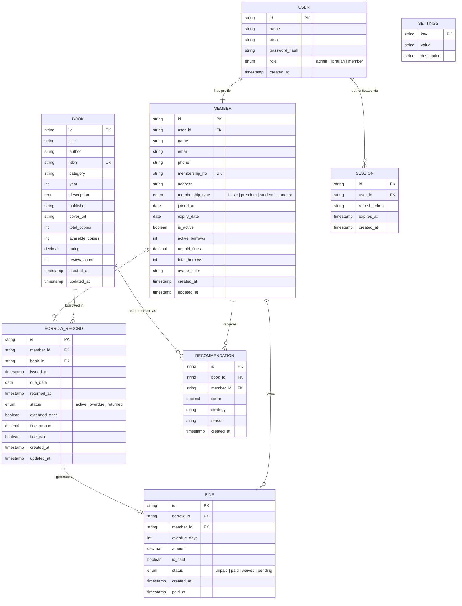

# Library Management System — ER Diagram



---

## Relationships Summary

| Relationship                | Type     | Description                                        |
| --------------------------- | -------- | -------------------------------------------------- |
| `User` → `Member`           | 1 : 1    | Every member account has one user login            |
| `User` → `Session`          | 1 : N    | A user can have multiple active sessions (devices) |
| `Member` → `BorrowRecord`   | 1 : N    | A member can borrow many books over time           |
| `Book` → `BorrowRecord`     | 1 : N    | A book can be borrowed many times                  |
| `BorrowRecord` → `Fine`     | 1 : 0..1 | A borrow generates at most one fine                |
| `Member` → `Fine`           | 1 : N    | A member can accumulate many fines                 |
| `Book` → `Recommendation`   | 1 : N    | A book can be recommended to many members          |
| `Member` → `Recommendation` | 1 : N    | A member can receive many recommendations          |

---

## Key Constraints

| Rule                             | Enforcement                                                   |
| -------------------------------- | ------------------------------------------------------------- |
| Max 3 active borrows per member  | `CHECK (active_borrows <= 3)` on `MEMBER` + app logic         |
| Book available copies ≥ 0        | `CHECK (available_copies >= 0)` on `BOOK`                     |
| Extension only once per borrow   | `extended_once BOOLEAN` — set to `true` after first extension |
| Fine rate: ₹5/day overdue        | Stored in `SETTINGS` table as `fine_rate_per_day = 5`         |
| Default borrow duration: 14 days | Stored in `SETTINGS` as `borrow_duration_days = 14`           |
| Extension adds 7 days            | Stored in `SETTINGS` as `extension_days = 7`                  |
| `membership_no` globally unique  | `UK` constraint on `MEMBER.membership_no`                     |
| `isbn` globally unique           | `UK` constraint on `BOOK.isbn`                                |

---

## Atomic Transactions Required

```
── Issue Book ──────────────────────────────────────────────
BEGIN
  INSERT INTO borrow_record (member_id, book_id, ...)
  UPDATE book SET available_copies = available_copies - 1
  UPDATE member SET active_borrows = active_borrows + 1
COMMIT

── Return Book ─────────────────────────────────────────────
BEGIN
  UPDATE borrow_record SET returned_at = NOW(), status = 'returned'
  UPDATE book SET available_copies = available_copies + 1
  UPDATE member SET active_borrows = active_borrows - 1
  INSERT INTO fine (...) IF overdue
  UPDATE member SET unpaid_fines = unpaid_fines + fine_amount IF overdue
COMMIT

── Pay Fine ────────────────────────────────────────────────
BEGIN
  UPDATE fine SET is_paid = true, status = 'paid', paid_at = NOW()
  UPDATE borrow_record SET fine_paid = true
  UPDATE member SET unpaid_fines = unpaid_fines - fine.amount
COMMIT
```
